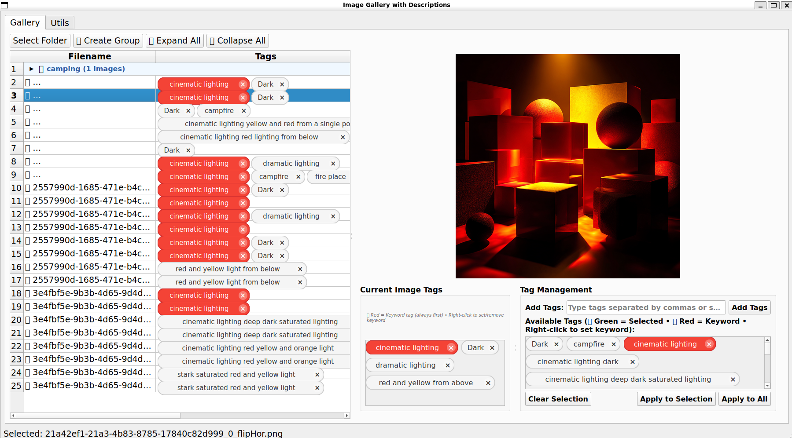

# Image Gallery with Descriptions

A comprehensive tool for organizing, managing, and AI-enhancing image datasets for machine learning training.

## Overview

This application provides a complete workflow for dataset preparation, combining manual organization tools with AI-powered description enhancement. Built with a clean tabbed interface, it supports multi-selection operations and integrates with oLLama for intelligent description rephrasing.

**Perfect for preparing training data for image generation models like Stable Diffusion, DALL-E, and other diffusion models.**




## Features

### 🖼️ **Gallery Management**
- **Multi-Selection Support**: Ctrl+click and Shift+click for batch operations
- **Real-time Preview**: Large image display with instant description editing
- **Smart Loading**: Automatically loads descriptions from .txt files or consolidated JSON
- **Flexible Save Options**: Individual .txt files + consolidated JSON export
- **Context Menu**: Right-click to remove images from dataset

### 🛠️ **Image Processing (Utils Tab - Left Panel)**
- **Fix Images**: Resize, pad, and standardize image dimensions (512/1024/2048px)
- **Mass Rename**: Batch rename with custom prefixes and sequential numbering
- **Dataset Augmentation**: Create duplicates with transformations:
  - Simple duplication (`_dup` suffix)
  - Horizontal flip (`_flipHor`)
  - 90° rotations (`_rotLeft`, `_rotRight`)
  - 180° rotation (`_flipVert`)

### 🤖 **AI Description Enhancement (Utils Tab - Right Panel)**
- **oLLama Integration**: Connect to local oLLama server for description rephrasing
- **Custom Prompts**: Full control over AI rephrasing instructions
- **Test Interface**: Preview AI output before batch processing
- **Batch Processing**: Rephrase descriptions while preserving names and details
- **WSL Support**: Configurable server/port for cross-platform development

### 🎯 **Scope-Aware Operations**
Every utility respects your selection:
- **"All Images"**: Process entire dataset
- **"Selected Only"**: Process only highlighted images
- **Smart UI**: Options auto-enable/disable based on selection state

## Requirements

- **Python 3.8+**
- **PyQt6**: Modern GUI framework
- **PIL/Pillow**: Image processing
- **Requests**: oLLama API communication (optional)

### Installation
```bash
pip install PyQt6 pillow requests
```

### For oLLama Integration (Optional)
```bash
# Install oLLama (https://ollama.ai)
# Then pull a model:
ollama pull llama3.2:3b
ollama serve
```

## Quick Start

```bash
# Clone and run
git clone [repository]
cd image-gallery
python image_gallery.py
```

## Usage Guide

### Basic Workflow

1. **Load Dataset**: Gallery tab → "Select Folder"
2. **Review & Edit**: Browse images, edit descriptions manually
3. **Process Images**: Utils tab → Fix dimensions, rename, or duplicate
4. **AI Enhancement**: Utils tab → Rephrase descriptions with oLLama
5. **Save Results**: Gallery tab → "Save Descriptions"

### Multi-Selection Operations

- **Select Multiple**: `Ctrl+Click` individual images or `Shift+Click` ranges
- **Scope Selection**: Choose "All" or "Selected Only" for each operation
- **Visual Feedback**: Green status bar shows current selection

### oLLama Setup

#### Standard Setup (Linux/Windows)
```bash
ollama serve
# Server: localhost, Port: 11434
```

#### WSL Setup (Linux on Windows)
```powershell
# In Windows PowerShell:
$env:OLLAMA_HOST="0.0.0.0:11434"
ollama serve

# In WSL, find Windows host IP:
ip route show | grep default
# Use that IP (e.g., 172.23.64.1) in the Server field
```

### File Format Support

**Input Formats:**
- **Images**: .jpg, .jpeg, .png, .webp
- **Descriptions**: Individual .txt files or consolidated .json

**Output Formats:**
- **Individual**: `imagename.txt` per image
- **Consolidated**: `foldername_descriptions.json`
- **Processed Images**: Same format as input, optimized for training

## Advanced Features

### Custom AI Prompts

Default rephrasing prompt:
```
Rephrase the following image description. Keep all specific names, details, and technical terms exactly the same. Only change the phrasing and sentence structure to make it sound different while preserving all information. Return only the rephrased description with no additional text:

{description}
```

**Customize for your needs:**
- Art style analysis
- Character-focused descriptions  
- Technical specifications
- Creative variations

### Batch Keywords

Add common elements to all descriptions:
1. Enter keyword in "Key Word String" field
2. Press Enter to append to all descriptions
3. Maintains proper spacing automatically

### Image Validation

**Automatically detects and reports:**
- Corrupt or unreadable images
- Images below minimum size (512x512)
- Format compatibility issues

## Architecture

### Modular Design
```
image_gallery/
├── image_gallery.py      # Main application (300 lines)
├── data_manager.py       # Data loading/saving (200 lines)  
├── image_processor.py    # Image processing (350 lines)
├── dialogs.py           # UI dialogs (150 lines)
└── README.md            # Documentation
```

### Key Benefits
- **Clean Separation**: UI, data, and processing logic separated
- **Easy Extension**: Add new features without complexity
- **Robust Error Handling**: Comprehensive validation and reporting
- **Cross-Platform**: Works on Windows, Linux, and WSL

## Keyboard Shortcuts

- **Ctrl + +**: Increase font size
- **Ctrl + -**: Decrease font size
- **Ctrl + 0**: Reset font size to default

## Common Workflows

### Small Dataset Expansion
1. Load 10-20 base images with descriptions
2. Use "Create Duplicates" with horizontal flip
3. Optionally add rotations for abstract content
4. Result: 20-80 images with preserved descriptions

### Description Variety
1. Load dataset with repetitive descriptions
2. Select images with similar descriptions
3. Use oLLama "Rephrase Selected Only"
4. Review and save enhanced dataset

### Dataset Standardization
1. Load mixed-size images
2. Use "Fix Images" with 1024px target
3. Choose square padding for training consistency
4. Export to separate folder for training

## Troubleshooting

### oLLama Connection Issues

**"Cannot connect to oLLama"**
```bash
# Check if oLLama is running
ollama list

# Start if needed
ollama serve

# For WSL users - bind to all interfaces
$env:OLLAMA_HOST="0.0.0.0:11434"
ollama serve
```

**"No models found"**
```bash
# Install a model
ollama pull llama3.2:3b
ollama pull llama3:8b
```

### Common Issues

**Images not loading**: Check file permissions and formats
**Description encoding**: Files saved with UTF-8 encoding
**Memory usage**: Close application between large datasets
**WSL networking**: Use Windows host IP instead of localhost

## Best Practices

### Dataset Organization
- Use consistent naming conventions before mass operations
- Keep original images separate from processed versions
- Backup description files before AI processing
- Test operations on small batches first

### AI Enhancement
- Always test prompts with sample descriptions
- Review AI output before accepting batch changes
- Keep prompt instructions specific and clear
- Consider different models for different content types

### Performance Tips
- Process images in batches of 50-100 for large datasets
- Use "Selected Only" for targeted operations
- Close other applications during intensive processing
- Save work frequently during long sessions

## Future Enhancements

**Planned Features:**
- Additional AI model integrations (OpenAI, Claude)
- Advanced filtering and search capabilities
- Export to ML framework formats (HuggingFace, COCO)
- Automated quality scoring and duplicate detection
- Cloud storage integration
- Plugin system for custom transformations

## Contributing

Contributions welcome! Areas of interest:
- Additional image transformations
- New AI model integrations
- Export format support
- UI/UX improvements
- Performance optimizations

## License

Open source under the MIT License.

---

**Built for the AI training community** - streamlining the dataset preparation process with intelligent tools and flexible workflows.